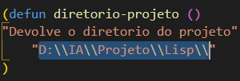
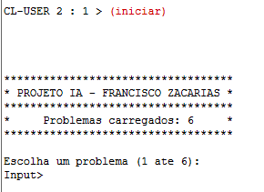
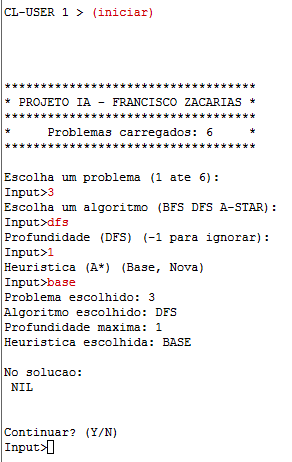

# Manual de Utilizador
Projeto realizado por: Francisco Zacarias nº190221105

Índice:
-   0 [Glossário](#0-Glossário)
-   1 [Introdução](#1-Introdução)
-   2 [Utilização](#2-Utilização)
    -   2.1 [Instalação do ambiente](#2.1-Instalação-do-ambiente)
    -   2.2 [Ficheiros do projeto](#2.2-Ficheiros-do-projeto)
-   3 [Escrita e leitura de ficheiros](#3-Escrita-e-leitura-de-ficheiros)
-   4 [Exemplo de Aplicação](#4-Exemplo-de-aplicação)
-   5 [Limitações técnicas](#5-Limitações-técnicas)


## 0 Glossário

**BFS** - Breadth-First-Search

**DFS** - Depth-First-Search

**A\*** - A-star

**Base/Nova** - Heurísticas implementadas

## 1 Introdução
---
Este manual irá guiar o utilizador através dos processos de instalação do ambiente do projeto, a instalação dos ficheiros, navegação geral da aplicação e o conteúdo dos ficheiros relevantes ao utilizador. Este manual apenas assume que o utilizador está familiarizado com as regras do jogo do quatro.

## 2 Utilização
--- 
Após obter a pasta com os ficheiros do projeto, deverá preparar o computador e os ficheiros de forma a que possam ser utilizados corretamente. É importante seguir este capítulo, pois o LispWorks não tem permissões de escrita nem leitura em certas partições do Windows.

### 2.1 Instalação
Para a utilização do jogo é recomendado a utilização do LispWorks, visto ter sido o ambiente de desenvolvimento utilizado para o desenvolvimento do projeto. A instalação da versão gratuita será suficiente.

### 2.2 Ficheiros do projeto
Esta é a estrutura de ficheiros que o projeto contém, onde os ficheiros *.lisp* são os ficheiros de implementação do jogo, o ficheiro problemas.dat contém os problemas iniciais do jogo e o ficheiro logs.dat contém as estatísticas de todos os algoritmos executados.
```
Pasta do projeto:

|---Lisp
|     |__procura.lisp
|     |__projeto.lisp
|     |__puzzle.lisp
|     |__problemas.dat
|     |__logs.dat
|
|---Manuais
|     |__ManualTecnico.md
|     |__ManualTecnico.pdf
|     |__ManualUtilizador.md
|     |__ManualUtilizador.pdf
```
A pasta do projeto deve ser colocada numa partição do computador onde o LispWorks tenha permissões de leitura e escrita. Á partida, qualquer partição que não contenha o sistema operativo será suficiente.
De seguida é necessária uma alteração no ficheiro projeto.lisp. Ao abrir o mesmo, existe uma função chamada ```diretorio-projeto```, que contém o caminho para a pasta do projeto.



O diretório destacado na imagem deve ser alterada para ajustar ao ambiente do utilizador.
Notar que, em Windows, são utilizadas duas ```"\"```, pois isto representa um caracter especial do lisp. Ao utilizar dois, estamos na verdade apenas a dizer ao lisp para ler só 1, por isso é fundamental que o caminho do diretório do projeto seja separado por ```"\\"``` e inclusivamente deixar mais duas no fim do caminho. 

## 3 Escrita e leitura de ficheiros

Como visto anteriormente, o projeto necessita de permissões de leitura e escrita. As permissões de leitura são necessárias para ler o ficheiro problemas.dat e importar os problemas dos mesmos. As permissões de escrita servem para escrever as estatísticas da execução dos algoritmos no ficheiro logs.dat. 
As estatísticas recolhidas são apresentadas no seguinte formato:
```
Problema: X || Algoritmo: Y || Heuristica: Z || Nos-Expandidos: A || Nos-Gerados: B || Penetrancia: C || Ramificação: D || Tempo de execução: Ems 
Solução do problema: (...)
```
Descrição detalhada:
- Problema: Numero do problema que foi resolvido.
- Algoritmo: Nome do algoritmo utilizado para resolver o problema.
- Heurística: Heurística utilizada pelo algoritmo, quando aplicável.
- Nós-Expandidos: Nós que o algoritmo utilizou para gerar sucessores-
- Nós-Gerados: Nós que o algoritmo gerou.

O utilizador poderá aceder às estatísticas de utilização no ficheiro e para interpreta-las basta identificar qual é que representa a execução que deseja (a ultima execução será sempre a ultima estatística do ficheiro). 

## 4 Exemplo de aplicação

Após ter o LispWorks aberto, é necessário compilar os ficheiros do projeto. Para isto, basta compilar e carregar o ficheiro projeto.lisp e o projeto fica pronto a ser utilizado.

Após compilado, o utilizador deverá introduzir, no REPL, a função ```(iniciar)```, onde será então apresentado o menu da aplicação.



De seguida o utilizador apenas tem que seguir as instruções dadas pelo programa. As opções que devem ser introduzidas irão sempre aparecer antes do pedido do input do utilizador.

A título de exemplo, apresento a sequência de comandos que fariam o projeto executar o algoritmo Depth-First-Search sobre o problema 3, com uma limitação na profundidade de nível 1.



## 5 Limitações Técnicas
Todo o utilizador da aplicação deve estar consciente das seguintes limitações do projeto:
- Não são feitas verificações aos inputs. Isto é, qualquer input do utilizador não é validado e será corrido pelo programa, o que poderá despoletar um erro no projeto. É, no entanto, apresenta a lista de opções válidas, sempre que é pedido input do utilizador.
- Quando qualquer algoritmo é executado pelo utilizador, é necessário definir qual a heurística, mesmo que esta seja irrelevante para o algoritmo escolhido.
- Executar o algoritmo a-estrela no problema 4 causa um stack overflow, onde é necessário utilizar fazer uma chamada à função ```(continue)``` 5 vezes, diretamente no REPL para o algoritmo prosseguir.
- Existe a possibilidade de alguns problemas não serem resolvidos, pelo que a aplicação terá que ser reiniciada, visto que por natureza, certos algoritmos requerem que seja encontrado uma solução.
