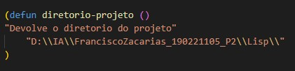
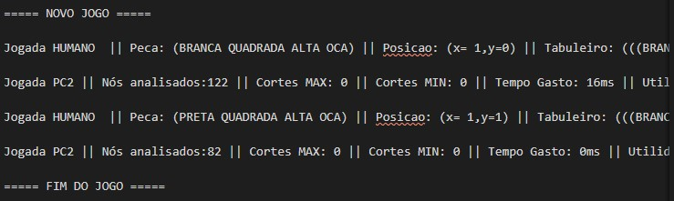
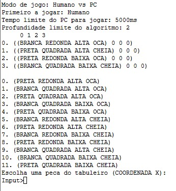
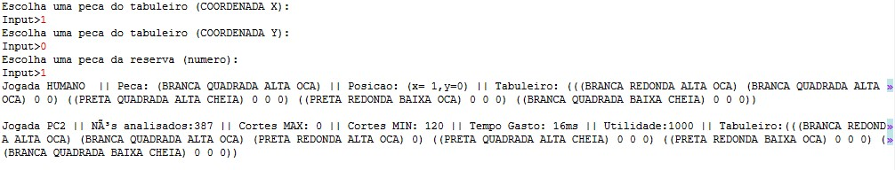
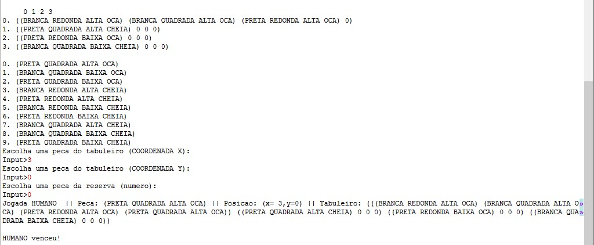

# Manual de Utilizador

Inteligência Artificial - Projeto 2 

Projeto realizado por: Francisco Zacarias nº190221105

# Table of Contents
- [Manual de Utilizador](#manual-de-utilizador)
- [Table of Contents](#table-of-contents)
- [0. Glossário](#0-glossário)
- [1. Introdução](#1-introdução)
- [2. Instalação e Utilização](#2-instalação-e-utilização)
  - [2.1 Instalação](#21-instalação)
  - [2.2 Utilização](#22-utilização)
- [3. Escrita de ficheiros](#3-escrita-de-ficheiros)
- [4. Exemplo de Aplicação](#4-exemplo-de-aplicação)
  - [4.1 Humano contra Computador](#41-humano-contra-computador)
    - [4.1.1 Jogada do humano](#411-jogada-do-humano)
- [5. Limitações a nível do utilizador](#5-limitações-a-nível-do-utilizador)

# 0. Glossário

*REPL* - *Read-Eval-Print Loop*

# 1. Introdução

Este manual irá guiar o utilizador através dos processos de instalação do ambiente do projeto, a instalação dos ficheiros, navegação geral da aplicação e o conteúdo dos ficheiros relevantes ao utilizador. Este manual apenas assume que o utilizador está familiarizado com as regras do jogo do quatro.

# 2. Instalação e Utilização

Este capítulo serve para o utilizador conseguir instalar e utilizar corretamente este jogo.

## 2.1 Instalação

Para instalar o jogo, é necessário extrair a pasta ```Lisp``` do diretório do projeto, para uma partição do computador onde o LispWorks tenha permissões de leitura e escrita. Á partida, qualquer partição que não contenha o sistema operativo será suficiente.
De seguida é necessária uma alteração no ficheiro projeto.lisp. Ao abrir o mesmo, existe uma função chamada ```diretorio-projeto```, que contém o caminho para a pasta do projeto.



O diretório destacado na imagem deve ser alterada para ajustar ao ambiente do utilizador.
Notar que, em Windows, são utilizadas duas ```"\"```, pois isto representa um caracter especial do lisp. Ao utilizar dois, estamos na verdade apenas a dizer ao lisp para ler só 1, por isso é fundamental que o caminho do diretório do projeto seja separado por ```"\\"``` e inclusivamente deixar mais duas no fim do caminho. 

## 2.2 Utilização

Para a utilização do projeto, é recomendado a utilização do *LispWorks*, pois foi o ambiente no qual o projeto foi testado. 

Para compilar o projeto, é apenas preciso compilar o ficheiro ```interact.lisp```, e esse ficheiro tratará de compilar os restantes. Para iniciar o jogo, o utilizador deve chamar, no *REPL*, a função iniciar i.e. (iniciar).

# 3. Escrita de ficheiros

Este programa vai escrever no ficheiro *logs.dat* as estatísticas das jogadas. Tanto para o jogador (tais como peca jogada, tabuleiro e posição) como para o Algoritmo.

No ficheiro há uma divisão entre os jogos para aumentar a legibilidade. Um jogo fica representado desta forma:



Para as jogadas do computador são guardadas as seguintes estatísticas:

- Nós analisados: Quantidade de nós que o algoritmo gerou
- Cortes MAX: Quantidade de cortes feitos para o MAX
- Cortes MIN: Quantidade de cortes feitos para o MIN
- Tempo gasto: Tempo que o algoritmo demorou a encontrar a melhor jogada, em milissegundos.
- Utilidade: Utilidade do nó escolhido
- Tabuleiro: Tabuleiro resultante do operador aplicado

# 4. Exemplo de Aplicação

Este jogo pode ser jogado de duas formas. Existe a possibilidade de um utilizador jogar contra um computador, ou de fazer o computador jogar contra ele próprio.

## 4.1 Humano contra Computador

Este modo de jogo é um modo de jogo interativo em que o utilizador vai jogar contra o computador. Ao iniciar o programa, deve ser escolhido a opção "Humano vs PC", quem joga primeiro, o tempo limite para o computador fazer uma jogada e a profundidade de procura do algoritmo.

### 4.1.1 Jogada do humano 

Quando é a vez do jogador, é apresentado o tabuleiro e a reserva no ecrã.



Para o utilizador jogar, terá que introduzir as coordenadas x e y, respetivamente da posição em que quer jogar.

As coordenadas do tabuleiro são da seguinte forma:

|||||
|-|-|-|-|
|0,0|0,1|0,2|0,3|
|1,0|1,1|1,2|1,3|
|2,0|2,1|2,2|2,3|
|3,0|3,1|3,2|3,3|

Isto significa que, a título de exemplo, se o jogador quiser jogar na primeira linha, coluna 2 iria introduzir 1 para o x, e 0 para o y.

Por fim, para escolher a peça que pretende jogar, deverá escolher o numero respetivo da peça, apresentado na reserva. Digamos que neste caso o utilizador queria jogar a peca (BRANCA QUADRADA ALTA OCA), na segunda posição, iria introduzir no jogo o numero 1.



Aqui vemos qual foi a jogada do utilizador, que é impressa logo depois de escolher a peça. Depois vê a jogada do computador, com as estatísticas incluídas.  

Após a jogada do computador, volta a apresentar o tabuleiro e é a vez do utilizador jogar. O jogo acaba quando há um empate, ou alguém venceu, como é apresentado na imagem seguinte.



# 5. Limitações a nível do utilizador 

Todos os utilizadores da aplicação deverão estar conscientes das seguintes limitações do projeto:
- Não são feitas verificações aos inputs. Isto é, qualquer input do utilizador não é validado e será corrido pelo programa, o que poderá despoletar um erro no projeto. É, no entanto, apresenta a lista de opções válidas, sempre que é pedido input do utilizador.
- Devido a limitações de performance, é possível que o computador não escolha uma jogada dentro do tempo limite se a profundidade for muito elevada. Em certas situações poderá mesmo acabar com a memória disponível do *LispWorks* e será necessário reiniciar o mesmo.